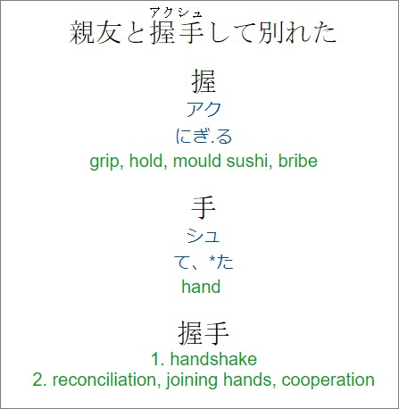
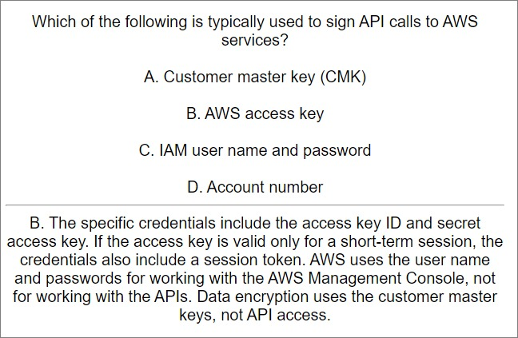
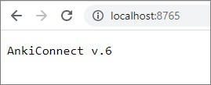

# Anki Connect Scripts

Scripts para adicionar flashcards no aplicativo [Anki](https://apps.ankiweb.net/) usando o plugin [AnkiConnect](https://ankiweb.net/shared/info/2055492159).

Desenvolvi este script para adicionar 2463 flashcards de estudos de japonês que seria totalmente inviável de adicionar manualmente.

E para adicionar 233 flashcards de questões sobre a certificação AWS.

Estou salvando no GitHub para usar como referência futura, para uso próprio, de como criar scripts usando o AnkiConnect.

## Preparações para executar o script

### AnkiConnect

Instale o [Anki Desktop](https://apps.ankiweb.net/#download)

Vá em **Tools** -> **Add-ons** -> **Get Add-ons...**. No campo **Code** insira o código do plugin [AnkiConnect](https://ankiweb.net/shared/info/2055492159) que é **2055492159**. Clique em **OK**. Espere aparecer a mensagem **Download complete. Please restart Anki to apply changes**.

Da mesma forma, instale o plugin [Japanese Support](https://ankiweb.net/shared/info/3918629684) (**3918629684**).

O AnkiConnect disponibiliza APIs HTTP para executar inúmeras ações no Anki. Sempre que ligar o Anki o AnkiConnect estará acessível em localhost:8765, portanto para executar os scripts é necessário estar com o Anki aberto.

A documentaçõe de todas as ações suportadas e exemplo de requisições estão documentadas no [repositório GitHub do AnkiConnect](https://github.com/FooSoft/anki-connect/#supported-actions).

### Arquivos

O `chuugakkou_kanji_sentence_cards.json` são mais de 2000 questões de Kanji que coletei via web scraping, já incluído sentença com furigana.

O arquivo da variável `KANJI_WORDS_DICT_JSON_FILE_PATH` precisa ser baixada [aqui](https://foosoft.net/projects/yomichan/#:~:text=jmdict_dutch.zip-,jmdict_english.zip,-jmdict_french.zip).

O arquivo da variável `KANJI_DICT_JSON_FILE_PATH` é uma versão [deste arquivo](https://foosoft.net/projects/yomichan/#:~:text=kanjidic_english.zip) que modifiquei removendo OnYomis e KunYomis que estão fora do Jouyou. Está zipado no arquivo `kanjidic_english_modified.zip`.

### Scripts

Os scripts `ScriptAddKanjiCardsWithMeanings` e `ScriptUpdateKanjiNotesToAddKanjiAndWordsMeaning` foram os primeiros scripts que criei. Não usam o `AnkiConnectService`, por isso a manutenibilidade está um pouco baixa. Os outros scripts estão mais fáceis de mexer.
